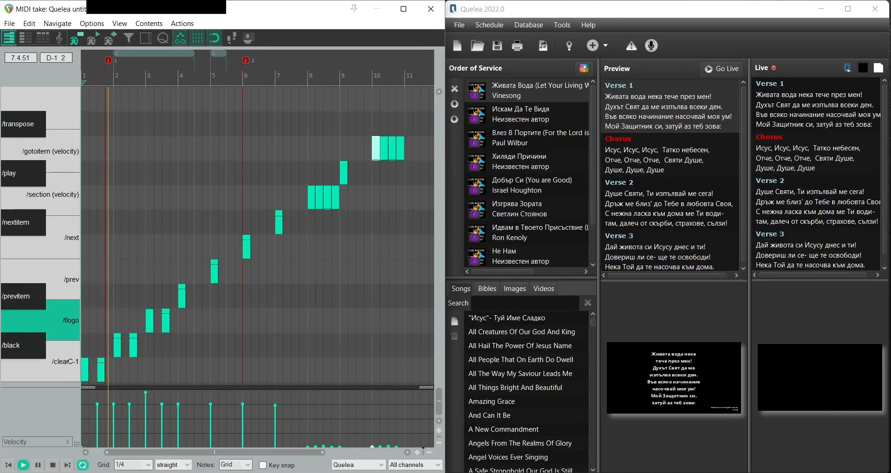

# DAW2PresentorMidiBridge
This project allows a DAW to control a presentation software like Qulea via MIDI

Link to the Quelea forum post with tutorial and demo:
https://quelea.discourse.group/t/i-am-making-available-a-ready-made-connection-server-just-a-background-program-for-daw-midi-to-quelea-control-its-plug-and-paly-sweet-tutorial-video-included/823

Reaper Forum post:
https://forum.cockos.com/showthread.php?t=265310

The server(service) is originally written in MATALB and also made available for Python.
You can run it as MATLAB code or Python code or use the executable for Windows.

Example preview:
